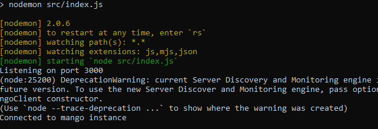

# Server in MongoDB for Nutrition App in React Native

## Setup

To run this project, install it locally:

```
$ cd ../nutrition-app-server
$ npm install

```

## Run

We need to enable nodemon listening via the command

```
$ cd ../nutrition-app-server
$ npm run dev

```

In this app - listening on port 3001


